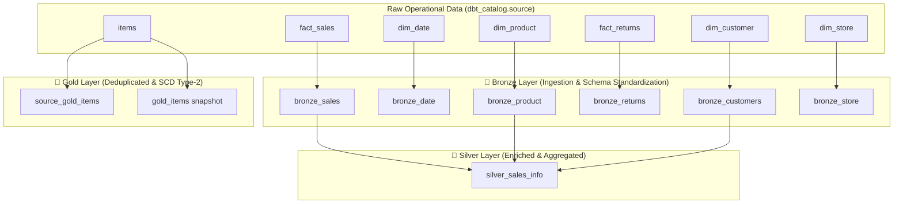

# 🚀 Databricks dbt Medallion Architecture (`dbt-databricks`)

[](https://docs.getdbt.com/)
[](https://databricks.com/)
[](https://python.org)
[](LICENSE)

A production-grade **dbt (Data Build Tool)** project implementing an end-to-end **Medallion Architecture (Bronze → Silver → Gold)** on **Databricks Delta Lake**. 

This project demonstrates modern data engineering practices including raw ingestion mapping, data enrichment, CTE joins, custom Jinja macros, Slowly Changing Dimensions (SCD Type-2), generic & singular testing, and automated build pipelines.

---

## 🏗️ Architecture Overview

The pipeline transforms raw operational source data into clean, business-ready data assets across three distinct medallion schemas:



---

## 📁 Repository Structure

```
dbt-databricks/
├── analyses/                  # SQL scripts & Jinja templates for ad-hoc analysis
│   ├── 1.sql
│   ├── jinja1.sql, jinja2.sql, jinja3.sql
│   └── query_macro.sql
├── macros/                    # Custom Jinja macros
│   ├── generate_schema.sql    # Custom schema naming convention macro
│   └── multiply.sql           # Multiplication SQL helper macro
├── models/
│   ├── source/
│   │   └── sources.yml        # Source declarations & raw table definitions
│   ├── bronze/                # Raw ingestion models (Materialized: table/view)
│   │   ├── bronze_customers.sql
│   │   ├── bronze_date.sql
│   │   ├── bronze_product.sql
│   │   ├── bronze_returns.sql
│   │   ├── bronze_sales.sql
│   │   ├── bronze_store.sql
│   │   └── properties.yml     # Schema docs & data quality tests
│   ├── silver/                # Enriched analytical tables
│   │   └── silver_sales_info.sql
│   └── gold/                  # Curated production-ready views
│       └── source_gold_items.sql
├── seeds/                     # Static reference datasets
│   └── lookup.csv
├── snapshots/                 # SCD Type-2 dimension snapshots
│   └── gold_items.yml
├── tests/                     # Data quality test definitions
│   ├── non_negative_test.sql  # Singular SQL test for non-negative amounts
│   └── generic/
│       └── generic_non_negatve.sql # Custom reusable generic test macro
├── dbt_project.yml            # Project config & materialization settings
└── profiles.yml               # Databricks connection profile template
```

---

## 📊 Medallion Layer Specifications

| Layer | Model | Materialization | Description |
| :--- | :--- | :--- | :--- |
| **Bronze** | `bronze_customers` | `table` | Ingests `dim_customer` |
| **Bronze** | `bronze_date` | `view` | Ingests `dim_date` calendar table |
| **Bronze** | `bronze_product` | `view` | Ingests `dim_product` catalog |
| **Bronze** | `bronze_returns` | `table` | Ingests `fact_returns` transaction log |
| **Bronze** | `bronze_sales` | `table` | Ingests `fact_sales` transaction records |
| **Bronze** | `bronze_store` | `table` | Ingests `dim_store` location data |
| **Silver** | `silver_sales_info` | `table` | Joins sales, products, and customers; computes gross sales via `multiply` macro aggregated by category & gender |
| **Gold** | `source_gold_items` | `view` | Deduplicates raw `items` using `ROW_NUMBER() OVER (PARTITION BY id ORDER BY updateDate DESC)` |
| **Snapshot** | `gold_items` | `snapshot` | Tracks historical SCD Type-2 updates on `source.items` |

---

## 🧪 Data Testing & Quality Control (17 Total Executed Nodes)

When running `dbt build`, dbt executes **17 total nodes** (8 models + 1 seed + 1 snapshot + 7 data tests):

1. `unique` — Validates unique `sales_id` on `bronze_sales`.
2. `not_null` — Ensures `sales_id` on `bronze_sales` is never null.
3. `not_null` — Ensures `customer_sk` on `bronze_customers` is never null.
4. `accepted_values` — Restricts `store_name` on `bronze_store` to valid retail stores.
5. `accepted_values` — Restricts `country` on `bronze_store` to `USA` or `Canada`.
6. `generic_non_negative` — Custom generic test macro ensuring `gross_amount` $\ge 0$.
7. `non_negative_test` — Singular test checking for negative values in `bronze_sales`.

---

## 🚀 Quickstart & Usage

### 1. Prerequisites
- Python 3.8+
- Databricks workspace with SQL Warehouse or All-Purpose Cluster
- Install `dbt-databricks`:
  ```bash
  pip install dbt-databricks
  ```

### 2. Configure Profile
Ensure your `profiles.yml` (located at `~/.dbt/profiles.yml` or project root) is configured for Databricks:
```yaml
dish_dbt:
  target: dev
  outputs:
    dev:
      type: databricks
      catalog: dbt_catalog
      schema: dev
      host: <your-databricks-host>
      http_path: <your-sql-warehouse-http-path>
      token: <your-personal-access-token>
```

### 3. Execution Commands

```bash
# Test connection
dbt debug

# Load seed datasets
dbt seed

# Run transformations
dbt run

# Run snapshots (SCD Type-2)
dbt snapshot

# Execute data quality tests
dbt test

# Execute entire pipeline DAG (17 Nodes)
dbt build
```

---

## 📜 License

This project is licensed under the MIT License.
